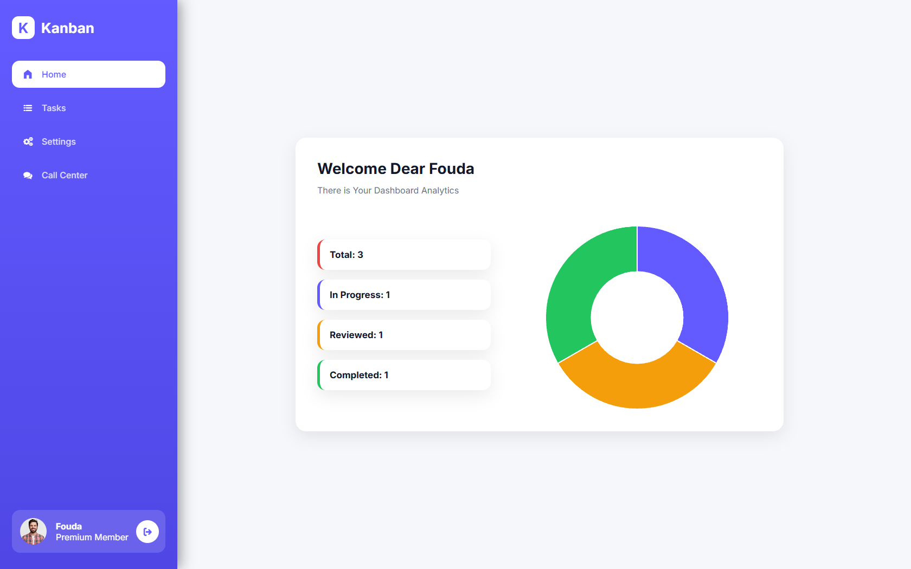

# 🚀 Kanban Dashboard



A modern and responsive Kanban Dashboard built with **HTML, CSS, and Vanilla JavaScript**.

The application helps users organize their workflow using a Kanban board while providing useful analytics, task management, and a clean user experience.

---

## ✨ Features

- ✅ Create Tasks
- ✏️ Edit Existing Tasks
- 🗑️ Delete Tasks
- 📦 Local Storage Persistence
- 📊 Analytics Dashboard (Chart.js)
- 🌙 Dark Mode
- 🔍 Live Search
- 🔄 Sort Tasks (A-Z / Newest)
- 📱 Fully Responsive Design
- 📧 Contact Form using EmailJS
- 👤 User Profile & Avatar Selection
- 🎯 Task Status Management
- 📌 Kanban Board Layout
- 🖱️ Drag & Drop Support

---

## 🛠️ Built With

- HTML5
- CSS3
- Vanilla JavaScript (ES6 Modules)
- LocalStorage API
- Chart.js
- EmailJS

---

## 📁 Project Structure

```
├── css
├── imgs
├── js
│   ├── analytics.js
│   ├── auth.js
│   ├── confirm.js
│   ├── drag.js
│   ├── modal.js
│   ├── search.js
│   ├── sort.js
│   ├── tasks.js
│   └── ...
├── index.html
└── README.md
```

---

## 🎯 Main Functionalities

### Task Management

- Create tasks
- Edit tasks
- Delete tasks
- Change task status
- Drag tasks between columns

### Analytics

- Total Tasks
- In Progress Tasks
- Reviewed Tasks
- Completed Tasks
- Dynamic Doughnut Chart

### User Experience

- Responsive Layout
- Dark Mode
- Smooth Animations
- Toast Notifications
- Confirmation Dialogs

---

## 📱 Responsive Design

Optimized for:

- Desktop
- Laptop
- Tablet
- Mobile

---

## 🚀 Getting Started

Clone the repository

```bash
git clone https://github.com/yourusername/kanban-dashboard.git
```

Open

```text
index.html
```

No installation is required.

---

## 💡 Future Improvements

- Backend Integration
- User Authentication
- Cloud Database
- Due Dates
- Labels
- Team Collaboration
- Notifications
- Calendar View

---

## 👨‍💻 Author

Mahmoud Fouda

GitHub

https://github.com/mahmoudfoudaa4a

---

## ⭐ Support

If you like this project, don't forget to give it a ⭐ on GitHub.
